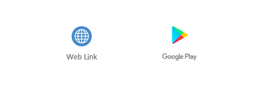
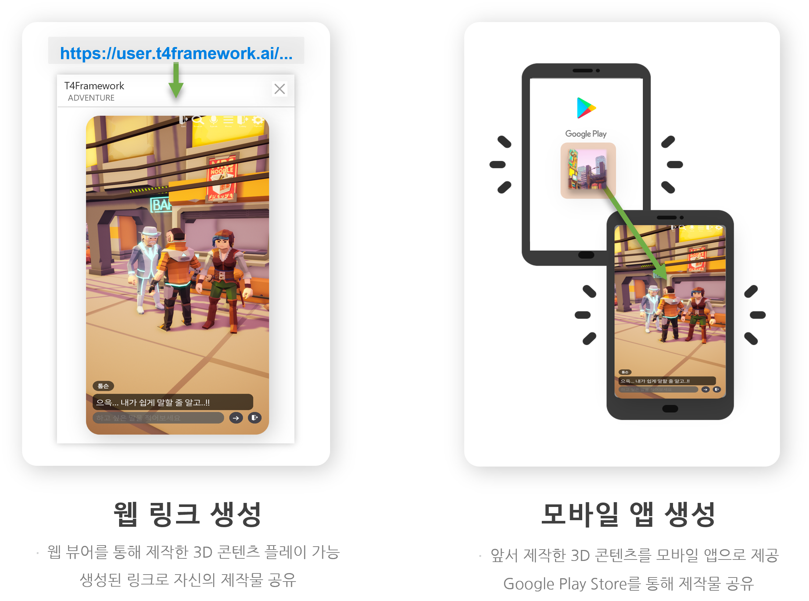

---
layout: page
title: T4Framework.AI
subtitle: Imagine as word, Create as world
bigimg: /img/QuestFlow.png

---

T4Framework.AI는 웹 베이스 기반의 Text to Game으로  AI와 함께 손쉽게 인터랙티브 게임을 제작할 수 있는 노코딩 서비스입니다.1

 

<h2>T4Framework.AI 알아보기</h2>

 <h4>생성형 AI의 도움을 받아 텍스트 입력만으로</h4>

<h4>나만의 게임을 손쉽게 만들고 경험해볼 수 있습니다.  </h4>

<iframe src="https://www.youtube.com/embed/q3cdVJblMxk" frameborder="0"></iframe>

<h5>T4Framework - Text to Game</h5>

 
 
 

<h2>나만의 게임을 공유해보세요.</h2>

<h4>클릭 한번으로 제작한 게임을 웹과 앱으로 소장할 수 있습니다.</h4>

 

 

 
 
 

<h2>나만의 게임을 공유해보세요.</h2>

 <h4>클릭 한번으로 제작한 게임을 웹과 앱으로 소장할 수 있습니다.</h4>

 
